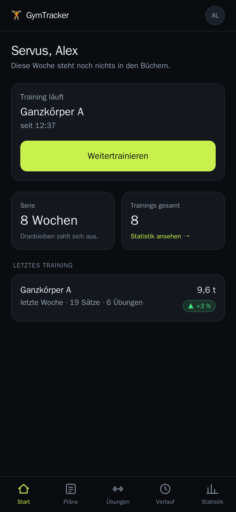
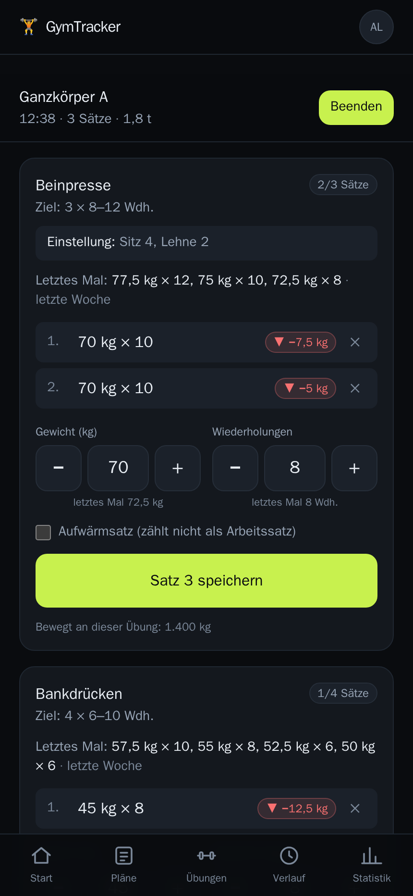
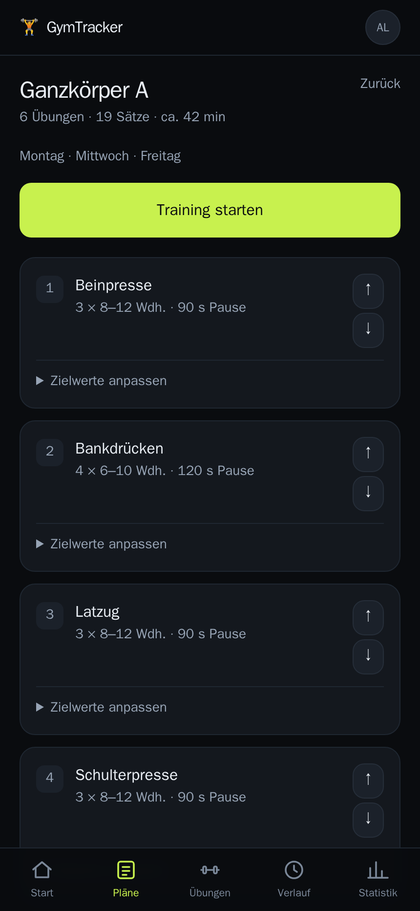
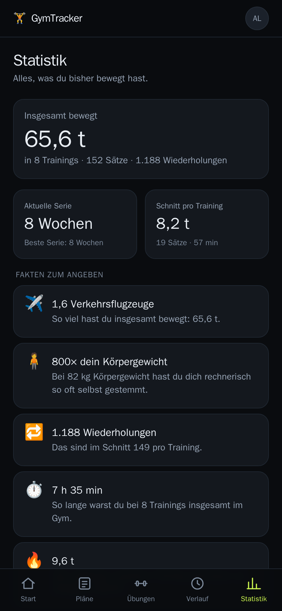
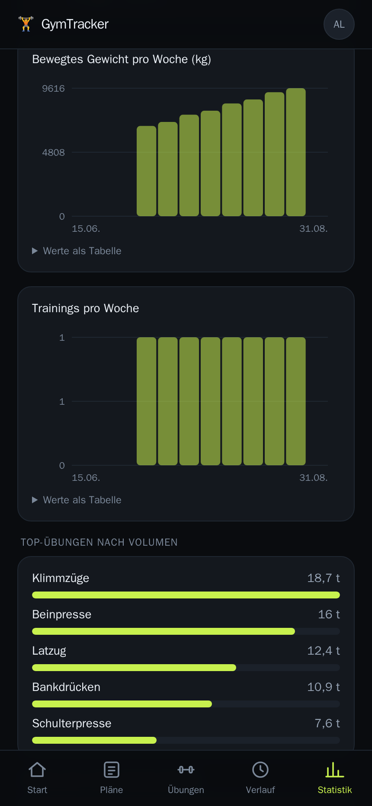
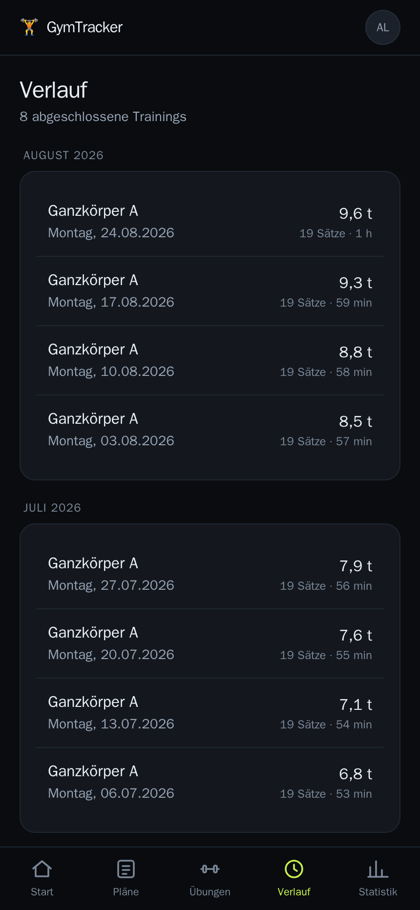

# GymTracker

[](https://github.com/pvillmann/gymtracker/actions/workflows/docker.yml)

Ein selbst gehosteter Gym-Tracker: Trainingsplan hinterlegen, im Gym die Sätze
mit Gewicht und Wiederholungen mitschreiben und dabei immer sehen, was beim
letzten Mal an derselben Maschine stand — und ob es heute besser oder schlechter
läuft.

Für das Handy gebaut: große Tap-Ziele, Plus/Minus-Tasten in den Gewichtsstufen
der jeweiligen Maschine, dunkles Design, funktioniert als Web-App auf dem
Homescreen.

## Screenshots

<table>
  <tr>
    <td width="33%"><br />Start</td>
    <td width="33%"><br />Training mitschreiben</td>
    <td width="33%"><br />Trainingsplan</td>
  </tr>
  <tr>
    <td width="33%"><br />Statistik &amp; Fun Facts</td>
    <td width="33%"><br />Verlaufscharts</td>
    <td width="33%"><br />Verlauf</td>
  </tr>
</table>

## Was drin ist

**Training mitschreiben**
- Satz für Satz Gewicht und Wiederholungen erfassen, mit +/− in der
  Gewichtsstufe der Maschine (die Beinpresse springt in 5 kg, die Kurzhantel in 2 kg)
- Über jedem Eingabefeld steht, was beim letzten Mal in genau diesem Satz stand
- Jeder gespeicherte Satz bekommt sofort ein Vergleichs-Label: ▲ +5 kg, ▼ −1 Wdh. oder „gleich"
- Pausentimer startet automatisch nach dem Satz und vibriert, wenn er abgelaufen ist
- Notizfeld pro Maschine für die Einstellungen (Sitzhöhe, Lehne, Griff)
- Aufwärmsätze zählen nicht als Arbeitssätze
- Übungen lassen sich spontan ergänzen, auch wenn sie nicht im Plan stehen

**Pläne und Übungen**
- Mehrere Trainingspläne mit sortierter Übungsreihenfolge und Zielvorgaben
  (Sätze, Wiederholungsbereich, Pausenlänge)
- Ein Startpaket gängiger Geräte lässt sich per Klick anlegen
- Drei Messarten: Gewicht × Wiederholungen, Körpergewicht (+ Zusatzgewicht) und Zeit

**Fortschritt sehen**
- Pro Übung: Verlaufskurve des besten Satzes, schwerstes Gewicht, bestes Training
- Der Vergleich läuft über das geschätzte 1RM (Epley), damit 60 kg × 10 und
  70 kg × 6 vergleichbar sind
- Neue persönliche Rekorde werden nach dem Training markiert
- Statistik: bewegtes Gesamtgewicht, Wochenverlauf, Trainingsserie in Wochen,
  Top-Übungen und Verteilung nach Muskelgruppe
- „Fakten zum Angeben": das bewegte Gewicht in Elefanten, Linienbussen oder
  Vielfachen des eigenen Körpergewichts

**Mehrere Nutzer**
- Registrierung mit E-Mail und Passwort (scrypt-Hash), Session-Cookies
- E-Mail-Bestätigung ist Pflicht: ohne Klick auf den Link in der
  Willkommensmail kein Login
- "Passwort vergessen" per Mail-Link, invalidiert dabei alle bestehenden
  Sessions des Kontos
- Jeder Nutzer sieht ausschließlich seine eigenen Pläne, Übungen und Trainings
- Die Registrierung lässt sich über `REGISTRATION_CODE` hinter einen Code sperren
- Konto selbst restlos löschen (mit Passwort-Bestätigung) – entfernt wirklich
  alles: Pläne, Übungen, Trainings, Sätze, Sessions

## Schnellstart mit Docker

Das Image wird bei jedem Push auf `main` automatisch gebaut und öffentlich
unter `ghcr.io/pvillmann/gymtracker:latest` veröffentlicht (Details unten) —
du musst das Repo dafür nicht klonen.

SMTP-Zugangsdaten sind **Pflicht** (siehe [E-Mail-Versand](#e-mail-versand) unten)
— ohne sie kommt niemand über die Bestätigungsmail hinaus.

**Nur mit Docker, ganz ohne Repo:**

```bash
docker run -d \
  --name gymtracker \
  --restart unless-stopped \
  -p 3000:3000 \
  -v gymtracker-data:/data \
  -e SMTP_HOST=smtp.example.com \
  -e SMTP_PORT=587 \
  -e SMTP_USER=dein-nutzername \
  -e SMTP_PASSWORD=dein-passwort \
  -e SMTP_FROM="GymTracker <noreply@example.com>" \
  -e APP_URL=http://<dein-server>:3000 \
  ghcr.io/pvillmann/gymtracker:latest
```

**Mit Compose** (praktischer für Umgebungsvariablen, Reverse Proxy etc.):

```bash
git clone https://github.com/pvillmann/gymtracker.git
cd gymtracker
docker compose pull
docker compose up -d
```

Willst du stattdessen aus dem Quellcode bauen, z. B. um eigene Änderungen zu
testen: `docker compose up -d --build` statt `pull` + `up -d`.

Danach `http://<dein-server>:3000` öffnen, ein Konto anlegen — der erste
registrierte Nutzer ist einfach der erste Nutzer, es gibt keine Admin-Rolle.

Die Datenbank wird beim ersten Start automatisch angelegt und migriert. Sie
liegt im Docker-Volume `gymtracker-data` unter `/data/gym.db`.

### Registrierung zumachen

Solange kein `REGISTRATION_CODE` gesetzt ist, kann sich jeder registrieren, der
die URL kennt. Für eine öffentlich erreichbare Instanz in der
`docker-compose.yml` setzen:

```yaml
environment:
  REGISTRATION_CODE: "dein-geheimer-code"
```

Danach `docker compose up -d` — bestehende Konten bleiben, neue brauchen den Code.

### Hinter einem Reverse Proxy

Das Session-Cookie wird nur dann als `secure` gesetzt, wenn die Verbindung
tatsächlich über HTTPS läuft. Sonst wäre der Login über `http://nas.local:3000`
im Heimnetz stillschweigend kaputt — der Browser würde das Cookie verwerfen.

Erkannt wird das über `X-Forwarded-Proto`. Falls dein Proxy den Header nicht
schickt, obwohl er HTTPS terminiert, setze `COOKIE_SECURE=true`.

Beispiel für Caddy:

```
gym.example.com {
    reverse_proxy localhost:3000
}
```

Und in der `docker-compose.yml` den Port auf `127.0.0.1:3000:3000` einschränken,
damit der Container nicht direkt aus dem Netz erreichbar ist.

## E-Mail-Versand

Läuft über SMTP mit Zugangsdaten in der `.env` bzw. `docker-compose.yml` —
kein Drittanbieter-Account nötig, funktioniert mit praktisch jedem Provider
(eigener Mailserver, Domain-Hoster, ein App-Passwort bei Gmail o. ä.):

```yaml
environment:
  SMTP_HOST: "smtp.example.com"
  SMTP_PORT: "587"
  SMTP_USER: "dein-nutzername"
  SMTP_PASSWORD: "dein-passwort"
  SMTP_FROM: "GymTracker <noreply@example.com>"
  APP_URL: "https://gym.example.com"
```

`APP_URL` ist die Adresse, unter der GymTracker für deine Nutzer erreichbar
ist — wird für die Links in Bestätigungs- und Passwort-Reset-Mails gebraucht
(in einer Mail funktioniert kein relativer Link). Ohne `/` am Ende angeben.

`SMTP_PORT` bestimmt automatisch, ob TLS direkt (Port 465) oder per STARTTLS
(alles andere) genutzt wird. Erwartet dein Provider auf einem anderen Port
trotzdem implizites TLS, kannst du das mit `SMTP_SECURE: "true"` erzwingen.

Schlägt der Versand fehl (SMTP nicht erreichbar, falsche Zugangsdaten), bleibt
das Konto trotzdem angelegt — der Nutzer landet auf einer Seite mit einem
"Erneut senden"-Button, sobald der Mailserver wieder erreichbar ist.

**Lokal testen ohne echte Zugangsdaten**: ein Fake-SMTP-Server wie
[MailHog](https://github.com/mailhog/MailHog) fängt alle Mails ab und zeigt
sie in einer Weboberfläche:

```bash
docker run -d -p 1025:1025 -p 8025:8025 mailhog/mailhog
# SMTP_HOST=localhost, SMTP_PORT=1025, dann auf http://localhost:8025 schauen
```

## Backup

Alles steckt in einer einzigen SQLite-Datei. Sauber (also auch im laufenden
Betrieb konsistent) sicherst du sie so:

```bash
docker compose exec gymtracker \
  node -e "const D=require('better-sqlite3');new D('/data/gym.db').backup('/data/backup.db').then(()=>console.log('ok'))"
docker compose cp gymtracker:/data/backup.db ./gym-backup-$(date +%F).db
```

Ein einfaches `cp` der Datei reicht nicht zuverlässig, solange die App läuft:
SQLite schreibt im WAL-Modus, die Änderungen stecken dann noch in `gym.db-wal`.

## Update

Zwei Wege, je nachdem ob du das fertige Image aus der GitHub Container
Registry ziehen oder lokal bauen willst:

```bash
# Vorgebautes Image von GitHub holen (Standard, kein lokaler Build nötig)
git pull
docker compose pull
docker compose up -d

# Oder: lokal bauen, z. B. für eigene Änderungen
git pull
docker compose up -d --build
```

Neue Migrationen laufen beim Start automatisch. Vorher ein Backup zu ziehen,
schadet trotzdem nie.

## Vorgefertigtes Image (GitHub Container Registry)

Jeder Push auf `main` baut über [`.github/workflows/docker.yml`](.github/workflows/docker.yml)
automatisch das Produktions-Image und veröffentlicht es als
`ghcr.io/pvillmann/gymtracker:latest` (zusätzlich getaggt mit dem kurzen
Commit-Hash) — öffentlich abrufbar, kein Login nötig. Pull Requests bauen nur
zur Validierung, ohne zu veröffentlichen — das eignet sich als Pflicht-Check
für einen geschützten `main`-Branch.

`docker-compose.yml` verweist auf dieses Image (`image:`), behält aber
`build: .` als Fallback für lokale Änderungen.

Falls du das Image später auf **Settings → Change package visibility →
Private** stellst, muss sich der Server einmalig einloggen, z. B. mit einem
[Personal Access Token](https://github.com/settings/tokens) mit
`read:packages`-Recht:

```bash
echo "<dein-token>" | docker login ghcr.io -u <dein-github-nutzername> --password-stdin
```

## Lokale Entwicklung

```bash
npm install
npm run db:migrate     # legt data/gym.db an
npm run dev            # http://localhost:3000
```

Nützliche Skripte:

| Befehl | Zweck |
| --- | --- |
| `npm run dev` | Entwicklungsserver |
| `npm run build` | Produktions-Build (Standalone-Output für Docker) |
| `npm run typecheck` | TypeScript prüfen |
| `npm run db:generate` | Migration aus `src/db/schema.ts` erzeugen |
| `npm run db:migrate` | Migrationen anwenden |

### Umgebungsvariablen

| Variable | Standard | Bedeutung |
| --- | --- | --- |
| `DATABASE_PATH` | `./data/gym.db` lokal, `/data/gym.db` im Container | Pfad zur SQLite-Datei. Im Container von `docker-compose.yml` gesetzt – trag ihn nicht zusätzlich in die `.env` ein. |
| `REGISTRATION_CODE` | — | Wenn gesetzt, ist die Registrierung durch diesen Code geschützt |
| `COOKIE_SECURE` | automatisch | Erzwingt (`true`) oder verhindert (`false`) das `secure`-Flag des Session-Cookies |
| `SMTP_HOST` | — | Pflicht. Adresse des SMTP-Servers |
| `SMTP_PORT` | `587` | SMTP-Port |
| `SMTP_USER` / `SMTP_PASSWORD` | — | SMTP-Zugangsdaten |
| `SMTP_FROM` | — | Pflicht. Absender inkl. Anzeigename, z. B. `GymTracker <noreply@example.com>` |
| `SMTP_SECURE` | automatisch (Port 465) | Erzwingt implizites TLS unabhängig vom Port |
| `APP_URL` | — | Pflicht. Basis-URL für Links in Mails, ohne `/` am Ende |
| `TZ` | Systemzeitzone | Bestimmt, wann eine Trainingswoche beginnt |
| `PORT` | `3000` | Port des Servers |

## Technik

- **Next.js 16** (App Router, Server Actions) mit **React 19**
- **SQLite** über **better-sqlite3**, Schema und Abfragen mit **Drizzle ORM**
- **Tailwind CSS 4**
- Eigene Auth: scrypt-Passworthashes, Session-, Verifizierungs- und
  Reset-Tokens werden nur als SHA-256-Hash gespeichert — wer die Datenbank
  liest, kann damit weder eine Session übernehmen noch einen Mail-Link fälschen
- Mailversand über **nodemailer** direkt per SMTP, keine Drittanbieter-API
- Diagramme sind handgeschriebenes SVG, keine Chart-Bibliothek
- Docker-Image auf `node:22-trixie-slim` (aktuelle Debian-Stable-Basis)

### Aufbau

```
src/
  app/            Seiten – (auth) für Login/Registrierung, (app) für alles dahinter
  actions/        Server Actions (schreiben), jeweils mit Besitzprüfung
  components/     UI-Bausteine, u. a. der Satz-Logger und die Diagramme
  db/             Drizzle-Schema und SQLite-Verbindung
  lib/            Abfragen, Auth, Mailversand, Statistik, Formatierung
drizzle/          Generierte SQL-Migrationen
```

### Wie das bewegte Gewicht gerechnet wird

Volumen eines Satzes = Gewicht × Wiederholungen, aufsummiert über alle Sätze.
Bei Körpergewichts-Übungen (Klimmzüge, Dips) zählt das in den Einstellungen
hinterlegte Körpergewicht mit — sonst wären Klimmzüge rechnerisch wertlos.
Zeit-Übungen tragen kein Volumen bei.
